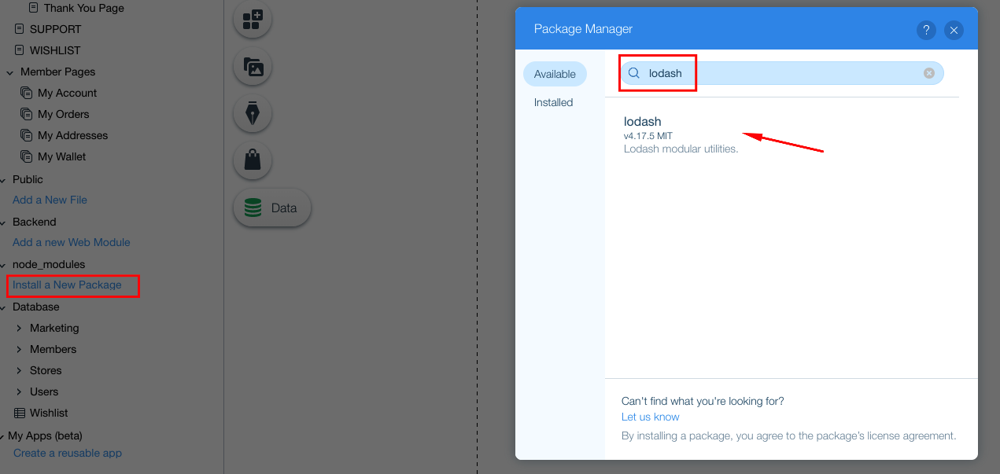
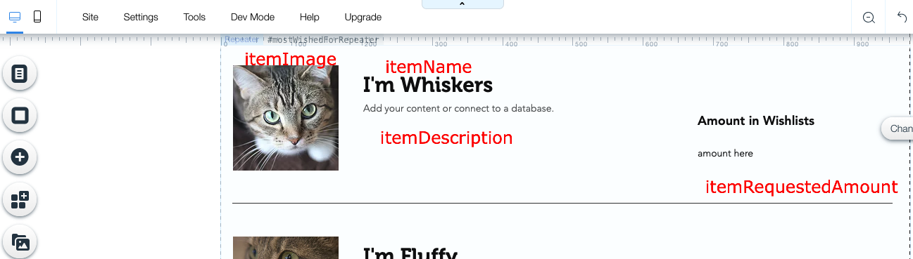

# wix-covid-wishlist
Getting started with Wix Corvid

# What does this walkthrough offer?
In this walkthrough we're going to create our very own Wishlist for a wix website!

we'll learn how to:
* Interact with page elements through Corvid.
* Use some of the various libraries that Corvid exposes to us for manipulating our website.
* Create our own database table and use CRUD (Create, Read, Update, Delete) operations on it.

# so let's get started!
the first thing we need is... a website! so let's start by creating a new website where we can try our code. since we're creating a Wishlist for an online store, select the "online-store" option when creating a new website. in case you created a different kind of website you can always enable it through the same menu that you add different elements to your website, just under the `store` section.

now, let's enable Corvid so we'll be able to modify what we need:


next, let's go to "Product Page" and create an `Add to wishlist` button.


### Bonus:
if you wanna be really fancy you can also add a popup that will show once an item has been added to wishlist:

we'll manipulate it later to show and hide with animations.
make sure to hide it on page load (this can be done by right clicking on the element, selecting the `View Properties` window from the menu and checking the `Hidden on Load` option).


we're going to need a database to store our Wishlist data, so let's create one.
in the sidebar under `Database` click the `Add a new collection` link and select the `start from scratch` option.
name the collection `Wishlist` and in permissions select `Member-generated content` so only members will be able to add and remove items from Wishlists.
> after creating the database save the site and refresh the page in order to see native collections, such as `Products` table.

now we're going to need to add columns to the table to store the `UserId, Product, AddedDate` and any other column that you want your users to fill that can be used later on.
> Do not modify the `Field key` of the column, the `Field key` is generated automatically based on the `Field name` and we're going to use it later to query and display the data. for example the column `UserId` should have a `Field name` named `userId`.

when creating the columns create them with the following types:
* UserId - Text
* Product - reference column that is referenced to the products table
* AddedDate - Date and Time
in case you made a mistake in the column creation you can edit it via the settings of the column. You may get a warning message, but that's ok because we haven't used the table yet.

Finally it's time to write some code!

open up the dev console by clicking on it in the lower part of the page:

you should see the default code:
```javascript
// For full API documentation, including code examples, visit http://wix.to/94BuAAs

$w.onReady(function () {
	//TODO: write your page related code here...

});
```

this function is called when the page is ready and elements are loaded into the page. If we try to access elements outside this function before the page load they won't work, so it's important that we do it here.

let's modify it by adding an `onClick` event for the button.
```javascript
$w.onReady(function () {
	$w('#AddToWishlistButton').onClick(onWishlistClicked);
});
```
you should see an error in the console, that's because we also need to change the Id of the button so we'll be able to find it and we also need to create a handler for the click.
in the editor right click on the button and select `View properties`. in the window that pops up rename the Id to `AddToWishlistButton` by clicking on it and typing it in the input.


and let's also create a function that will handle the click event below the `$w.onReady(...)` call.
```javascript
function onWishlistClicked() {
  console.log('hello world');
}
```
now if you preview the website you should be able to see the `"hello world"` in the console.

The `$w` and the `ID` field are very important parts in Corvid, In fact this is the way We can interact with elements as we've seen in the example above. those of you who are familiar with `jquery` will recognize the syntax straight away and for those who aren't, the `$w` is the object that allows us to get a reference to an element in the page based on the `ID` that we give him in the `ID` field using the syntax: `$w('#<ID>')`. e.g. for `ID: AddToWishlistButton` the call: `$w('#AddToWishlistButton')` will return a reference to the "add to wishlist" button.

In order to insert a new item in the database we need to expose a method from the `backend` that the `client` will invoke and as a result a new item will be added to the Wishlist collection.
In the sidebar, click the `+` when hovering over `backend` or expand it and click on `Add a new web module`. name the module `wishlist.jsw` and open it.

inside it add the following code:
```javascript
// Import the wix-users module for working with users.
import wixUsers from 'wix-users-backend';
// Import the wix-data module for working with queries.
import wixData from 'wix-data';

const collectionName = 'Wishlist';

export function insertWishlistItem(product) {
	// get the current user
	const user = wixUsers.currentUser;

	// check if user is a logged in member
	if (!user.loggedIn) {
		// if not return an indication that a user is not a member
		return false;
	}
	
	// otherwise insert a new entry to the collection
	return wixData.insert(collectionName, {
		// note the keys are the same as the ID of the column in the collection
		product: product._id,
		addedDate: new Date(),
		userId: user.id
	});
}
```
we've done a couple of things here. first we imported 2 modules: `wix-users-backend, wix-data`, the first is used to handle user status and in our case to check if the current user is a member or not (since only members should be able to update the table). the second is to manipulate collection data and in the above code, to add a new entry to the collection.
> Note that although product is a reference column and you may see the name of the product in the collection view page it is actually referenced by an id, in this case the `_id` field of the product. this is the same case when we are querying the data, as you'll see soon.

Now we need to call this code from the client, so let's do just that.
add the following import at the top:
```javascript
import { insertWishlistItem } from 'backend/wishlist.jsw';
```
and back in the product page let's replace the `onClick` handler with the following code:
```javascript
async function onWishlistClicked() {
	// get the current product in the product page
	const product = await $w('#productPage1').getProduct();
	// call the backend function to add the item
	await insertWishlistItem(product);
}
```
> Notes: 
> * make sure that the product component Id is `productPage1` or change it to yours.
now when we click on the button a new item should be added to the collection. you can verify this by previewing the page, clicking the button and then go back to the collection and see if it's added.
> * we can also insert to a collection directly from the client side without using a backend code, however this means that we will need to pass the `userId` to the insert method as a parameter and as a result a user maybe be able to insert Wishlist items for other memebers and we don't want to enable that...

But what about the case when our user isn't a member and he clicks the Wishlist button?
well we can prompt him to sign up instead! let's add the code that does that:
```javascript
async function onWishlistClicked() {
	// if user is not logged in, prompt him to login
	if (!wixUsers.currentUser.loggedIn) {
		await wixUsers.promptLogin();
		return;
	}
	
	// get the current product in the product page
	const product = await $w('#productPage1').getProduct();
	// call the backend function to add the item
	await insertWishlistItem(product);
}
```
and add the following import at the top:
```javascript
import wixUsers from 'wix-users';
```

We don't want the user to insert the same product multiple times to the Wishlist and we haven't added an option to remove it. we can solve both issues at the same time by coverting the `Add to Wishlist` button to a toggle button that will add or remove an item as necessary.

In order to do that we need 2 new functions in the `backend` that will handle these calls.
Let's add them:
```javascript
export function getItemInWishlist(productId) {
	const user = wixUsers.currentUser;
	// search the collection for item with the same userId and the given productId
	return wixData.query(collectionName)
	  .eq('userId', user.id)
	  // note that the query is done by Id for the reference column
	  .eq('product', productId)
	  .find();
}

export async function removeWishlistItem(productId) {
	const user = wixUsers.currentUser;

	// if user is not a member, don't remove anything
	if (!user.loggedIn) {
		return false;
	}
	const data = await getItemInWishlist(productId);
	
	if (data.items.length === 0) {
		return false;
	}
	return wixData.remove(collectionName, data.items[0]._id);
}
```
and now in the client we need to add the logic for the toggle button.
Again, let's extend the handler function:
```javascript
async function onWishlistClicked() {
	// if user is not logged in, prompt him to login
	if (!wixUsers.currentUser.loggedIn) {
		await wixUsers.promptLogin();
		return;
	}
	
	// get the current product in the product page
	const product = await $w('#productPage1').getProduct();
	// if item is already in list, the click should remove it and show the add button
	if (await isProductInWishlist()) {
		await removeWishlistItem(product._id);
		showAddToWishlistButton();
	} else {
		// otherwise add the product to the wishlist and show the remove button
		await insertWishlistItem(product);
		showRemoveFromWishlistButton();
	}
}
```
and add these functions at the bottom:
```javascript
async function isProductInWishlist() {
	const product = await $w('#productPage1').getProduct();
	const data = await getItemInWishlist(product._id);
	// if there are no item in array result then it's not in the wish list
	return data.items.length > 0;
}

function showAddToWishlistButton() {
	$w('#AddToWishlistButton').label = 'Add to wishlist!';
}

function showRemoveFromWishlistButton() {
	$w('#AddToWishlistButton').label = 'Remove from wishlist';
}
```
and these imports at the top:
```javascript
import { insertWishlistItem, getItemInWishlist, removeWishlistItem } from 'backend/wishlist.jsw';
```
we also need to update the `$w.onReady(...)` to reflect the initial state:
```javascript
$w.onReady(async function () {
	$w('#AddToWishlistButton').onClick(onWishlistClicked);
	if (await isProductInWishlist()) {
		showRemoveFromWishlistButton();
	} else {
		showAddToWishlistButton();
	}
});
```

### Bonus
If you added the popup before then here's the code to show it when the user adds an item to the Wishlist:
```javascript
async function onWishlistClicked() {
	// if user is not logged in, prompt him to login
	if (!wixUsers.currentUser.loggedIn) {
		await wixUsers.promptLogin();
		return;
	}
	
	// get the current product in the product page
	const product = await $w('#productPage1').getProduct();
	// if item is already in list, the click should remove it and show the add button
	if (await isProductInWishlist()) {
		await removeWishlistItem(product._id);
		showAddToWishlistButton();
	} else {
		// otherwise add the product to the wishlist and show the remove button
		await insertWishlistItem(product);
		
		$w('#insertWishlistNotif').show('fold');
		setTimeout(function () {
			$w('#insertWishlistNotif').hide('fade');
		}, 3000);
		
		showRemoveFromWishlistButton();
	}
}
```
the `show` and `hide` functions do... exactly what you expect, they show and hide the element and the extra parameter is the animation used to show and hide the element (the full list can be found in the documentation). we also added some code to hide it after 3 seconds so it won't just hang there...
> Note: make sure you use the correct Id for the popup.


### Time to build the Wishlist!
so far we only created the functionality to add and remove items from the list but we still can't see it.
For that we need to create a new page that will show the Wishlist itself.
So, add a new page named "Wishlist" and inside it add a new item from the `Lists & Grids` section. that will be our `repeater` and we'll use that to show the Wishlist.

update the Ids in the repeater so we'll be able to use them later on.
here's how my repeater looks like with the Ids I chose (writtend in red and `wishlistRepeater` as the Id of the repeater):


first we need a way to get the items. We can do that by adding another function to our `backend` file.
```javascript
export async function getWishlistItems() {
	const user = wixUsers.currentUser;
	
	// if this is not a member don't return any items
	if (!user.loggedIn) {
		return [];
	}
	return await wixData.query(collectionName)
		.eq('userId', user.id)
		// this will add the referenced product to the result
		.include('product')
		.find();
}
```

next, let's add a `loadWishlist` function on page load.
```javascript
// import backend functions
import { getWishlistItems, removeWishlistItem } from 'backend/wishlist';
// import the wix-location module for navigating to pages. we'll use that in a moment
import wixLocation from 'wix-location';

$w.onReady(function () {
	// hide repeater in case it has any previous unwanted items
	$w('#wishlistRepeater').hide();
	loadWishlist();
});

async function loadWishlist() {
	const data = await getWishlistItems();

	const repeater = $w('#wishlistRepeater');
	
	// assign items to repeater
	repeater.data = data.items;
	
	// set the handler that binds data for each item
	repeater.onItemReady(onWishlistItemReady);
	repeater.show();
}
```
as you can see we get the items from the `backend` and set them as the data for the grid. but we're still missing the function that binds the data to each row item. we'll do that right now.
```javascript
function onWishlistItemReady($item, wishlistItem) {
	// the referenced product is in the wishlist item since we included it in query
	const product = wishlistItem.product;
	
	// set the image src to the product's image
	$item('#wishlistImage').src = product.mainMedia;
	
	// let's add a click event to navigate to the product page when clicking on image
	$item('#wishlistImage').onClick(() => {
		// this is using wixLocation module to Navigate to the item's product page
		wixLocation.to(product.productPageUrl);
	});
	$item('#wishlistProductName').text = product.name;
	$item('#wishlistDescription').text = product.description;
	
	// here we're converting the 'added date' to a readable format
	$item('#wishlistAddedDate').text = wishlistItem.addedDate.toLocaleString();
	
	// if item is not in stock we shouldn't enable the button (assuming it's disabled by default)
	if (product.inStock) {
		$item('#wishlistAddToCart').enable();
		
		// for products that have variants we need to send the user to product page to select one
		// otherwise we can immediately add item to cart		
		const hasVariants = !isObjectEmpty(product.productOptions)
		
		if (hasVariants) {
			// set the button text to explain action
			$item('#wishlistAddToCart').label = 'Select variants';
			
			// set the navigation to the product page
			$item('#wishlistAddToCart').onClick(() => {
				// Navigate to the wishlist item's product page.
				wixLocation.to(product.productPageUrl);
			});
		} else {
			// otherwise we can add it to cart
			$item('#wishlistAddToCart').label = 'Add to cart';
			$item('#wishlistAddToCart').onClick(async () => {
				// in order to add to cart we have to use the cart icon
				// in case you don't want to show one in this page you can add an icon and hide it
				await $item('#shoppingCartIcon1').addToCart(product._id);
			});
		}
	}
}

// checks if object has any keys
function isObjectEmpty(obj) {
	return Object.entries(obj).length === 0 && obj.constructor === Object;
}
```
the `$item` is the element in the list that corresponds to the given `wishlistItem`, so we can use that to select any  previously defined sub-elements by the Ids we gave them and bind the data as we see fit.

now we're just missing the option to remove an item from the wishlist. let's implement that:
```javascript
function onWishlistItemReady($item, wishlistItem) {
	// same implementation as before
	//...
	
	// here we're converting the 'added date' to a readable format
	$item('#wishlistAddedDate').text = wishlistItem.addedDate.toLocaleString();
	
	// ------------ ADDED THESE LINES -------------------
	$item('#wishlistRemoveButton').onClick(async () => {
		await removeItemFromWishlist(product._id);
	});
	// ------------ END -------------------
	
	// if item is not in stock we shouldn't enable the button (assuming it's disabled by default)
	if (product.inStock) {
		// nothing changed here
		// ...
		} else {
			// otherwise we can add it to cart
			$item('#wishlistAddToCart').label = 'Add to cart';
			$item('#wishlistAddToCart').onClick(async () => {
				// in order to add to cart we have to use the cart icon
				// in case you don't want to show one in this page you can add an icon and hide it
				await $item('#shoppingCartIcon1').addToCart(product._id);
				// ------------ ADDED THESE LINES -------------------
				await removeItemFromWishlist(product._id);
				// ------------ END -------------------
			});
		}
	}
}

async function removeItemFromWishlist(productId) {
	// use the same backend call from before to remove the item
	await removeWishlistItem(productId);
	
	// load the list again after the item was removed
	await loadWishlist();
}
```

# Congragulations!


if you got to here then you have a fully functional wishlist in your website!
users should now be able to add and remove items from their Wishlist and as the site owner you can see the products in the collection and manage it as you see fit.

If you want to see how you can take this further check out the next step.

# Something Extra
So we have a fully functioning Wishlist, but I bet that with a little more effort we can improve it by a lot!

First things first, let's add some indications to a non-member user when he navigates to the Wishlist.

> Note that we're hiding it by default. we'll show it only if the user is not a member.
To do that we can add a condition for user membership in the `loadWishlist` function:
```javascript
async function loadWishlist() {
	// ------------ ADDED THESE LINES -------------------
	// check if user is a member
	const isLoggedIn = await isUserLoggedIn();
	if (!isLoggedIn) {
		$w('#wishlistNotLoggedIn').show();
		return;
	}
	// ------------ END -------------------
	// otherwise display the list just like before
	const data = await getWishlistItems();

	const repeater = $w('#wishlistRepeater');
	
	// assign items to repeater
	repeater.data = data.items;
	
	// set the handler that binds data for each item
	repeater.onItemReady(onWishlistItemReady);
	repeater.show();
}
```
That's already a nice edition to our website instead of showing some empty page.

How about the case when the user doesn't have anything in the Wishlist? let's add a text for that too!

As you can see in the image I've added another text in the same location as the member's text and i'm using the layers of the editor to select it and modify it (you can also use the layers functionality to show and hide other items so you can focus only on the parts that you need right now).

And just like before let's add the code that shows/hides the text when we want:
```javascript
async function loadWishlist() {
	// check if user is a member
	const isLoggedIn = await isUserLoggedIn();
	if (!isLoggedIn) {
		$w('#wishlistNotLoggedIn').show();
		return;
	}
	
	// otherwise display the list just like before
	const data = await getWishlistItems();

	const repeater = $w('#wishlistRepeater');
	// ------------ ADDED THESE LINES -------------------
	if (data.items.length === 0) {
		repeater.hide();
		$w('#wishlistNoItemsText').show();
		return;
	}
	// ------------ END -------------------
	
	// assign items to repeater
	repeater.data = data.items;
	
	// set the handler that binds data for each item
	repeater.onItemReady(onWishlistItemReady);
	repeater.show();
}
```
And now the user won't see a blank page when he has nothing in his Wishlist.

So we tweaked some thing to make our site more attractive to users but we haven't seen something new yet and this is the **EXTRA** part after all...

And that's why I want to show you how to create a custom page in your dashboard to show you which products your customers want the most! this could give you a real advantage is managing your online store.

Let's get right to it, in the editor go to the "add a new page" section and select `Dashboard Page`:


I named mine `Most Wished for products` so I could easily find it in the dashboard section.
You can navigate to the page through the pages menu:


What we're going to do is add another repeater like before, only this time we're going to do 2 new things:
1. create a more complex query to select all products that users wanted and count how many users added them to their wishlist.
2. use an external javascript library called `lodash` (a common utility library with many useful functions).

Let's get the library first so we could use it later. to install a library (also called a package) click on the `node_modules` section in the sidebar and then on the `Install a new package` link:


that's it for the package! we'll see how to use it soon.
Now we need to create a query to get the data that we want. We already know by now that the right place to put queries is in the `backend` section and we can add a function in our already existing file:
```javascript
// previously defined imports
// ...

// lodash package import
// note that's it's also possible to import like this: "import leDash from 'lodash'" 
// but conventions make us more professional :)
import _ from 'lodash';

// previously defined functions
// ...

export async function getMostWishedForItems() {
	// we're using wixData "aggregate" to group items
	const countedItemsPromise = wixData.aggregate(collectionName)
		// we want to group our data by products
		.group('product')
		// and count them
		.count()
		// and then run the query
		.run();
		
	// this is similar to getting all the products for a single user
	// but this time we're not filtering per user
	const getAllWishlistProductsPromise = wixData
		.query(collectionName)
		.include('productId')
		.find();
		
	// the Promise.all(...) receives an array of Promises and returns an array of resolved promises
	// this allows us to run the promises in parallel instead of one by one
	const result = await Promise.all([countedItemsPromise, getWishlistItems()]);
	
	// the counted items 
	const countedItems = result[0];
	const wishlistItems = result[1];
	const products = wishlistItems.items.map(item => item.productId);

	// all lodash functions are available through our imported "_" variable
	// lodash documentation can be found here: https://lodash.com/docs/4.17.15
	var merged = _.merge(_.keyBy(products, '_id'), _.keyBy(countedItems._items, '_id'));
	var values = _.values(merged);
	return { items: values };
}
```
let's take this step by step.
first we use `wixData` to create an aggregate query - this type of query (as the name states) aggregates several result according to the fields given the the `group` clause, in our case the `product` field. We want to count the amount of products in wishlists so we'll use the `count` aggregation for that. at the end we use the `run` to create a `Promise` that will be resolved when the query is finished.

The aggregation returns an array of items with the grouped by key and the count amount but not the details about the products themselves, which we need to show in our page. For that we also need to get the items and merge the two lists.

we're using the `Promise.all(...)` to get both results and now we can merge them into a single list containing products where each has a counter field named `count`.

Now comes the merging part. this may look confusing at first, but it's a little easier once we understand what each function does. As you can see we're using 3 functions from the `lodash` library: `merge, keyBy, values`, i'll explain them alongside their use in our code. let's talk about `keyBy` first, this function takes a list of objects and creates a single object composed keys generated by the second argument (in here it's the `_id` property of the object) and the value is a the list of items that matched that key. we're using this method for both lists so the merge function could merge by keys.

the `merge` function takes a source object and a target(s) object and merges the objects by their keys, since both objects contain the exact values that we need in their corresponding keys, the merge puts the `count` property in the matching `product` for each of the products.

last but not least, we need only the products with the counters, while we have a `{_id: productWithCountObj}`, so we create a list of only the values using the `values` method.

this process results in the list we need to show in our page, so we return an object containing the list.
> Note: we're returning an object instead of values due the way *Corvid* serializes object. trying to return an `array` from the backend to our client code will result in that array being serialized and to avoid that we're wrapping it in an object.


Man that was long! but now we can finally use it in our dashboard page.
We can drop in a repeater from the `lists & grids` section and set up Ids just like we did in the Wishlist page.
Here's mine for example:


and below is the code I used show the items. it's very similar to the Wishlist page code aside from the `count` property, that is the counter for the products.
```javascript
// Import backend functions to get and remove list items
import { getMostWishedForItems } from 'backend/wishlist';
// Import the wix-location module for navigating to pages.
import wixLocation from 'wix-location';

$w.onReady(function () {
	loadWishlist();
});

function onWishlistItemReady($w, product) {
	$w('#itemImage').src = product.mainMedia;
	$w('#itemImage').onClick(() => {
		// Navigate to the wishlist item's product page.
		wixLocation.to(product.productPageUrl);
	});
	$w('#itemName').text = product.name;
	$w('#itemDescription').text = product.description;
	$w('#itemRequestedAmount').text = product.count.toString();
}

async function loadWishlist() {
	const data = await getMostWishedForItems();

	const repeater = $w('#mostWishedForRepeater');
	repeater.data = data.items;
	repeater.onItemReady(onWishlistItemReady);
}
```
> Note: the `count` property is a `number` and we're converting it to a string, since `Texts` must be string.

That's it! hope you liked it and learned some new on the way :)


## additional info
* You can find a working example site [here](https://oripi3.wixsite.com/wishlisttest/wishlist).
* A link to corvid api can be found [here](https://www.wix.com/corvid/reference).
* Lodash documentation can be found [here](https://lodash.com/docs)

